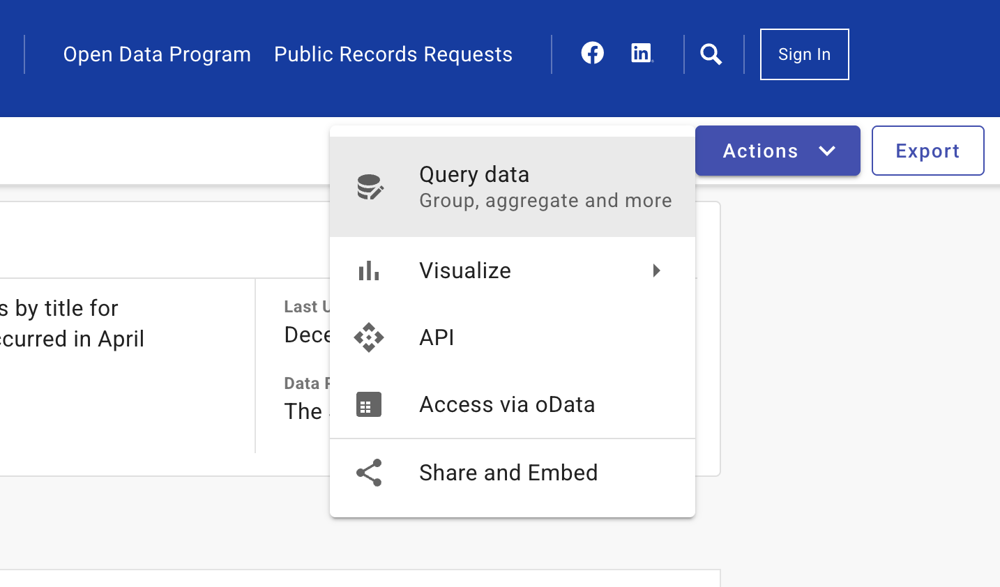
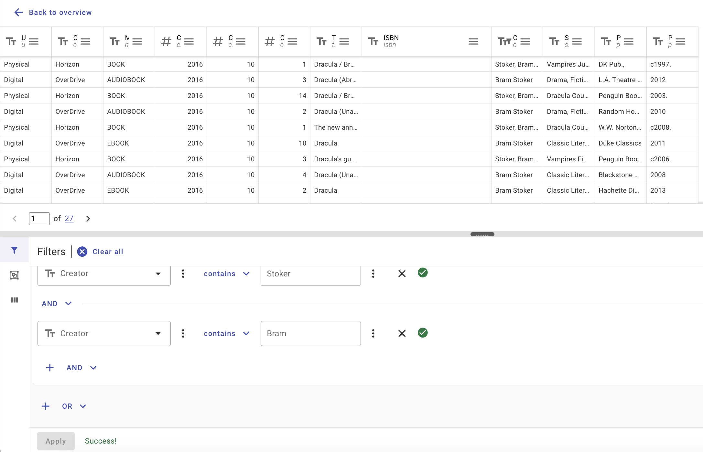

You can explore and download the Seattle Public Library's open checkout datasets through the City of Seattle's [Open Data Portal](https://data.seattle.gov/Community-and-Culture/Checkouts-by-Title/tmmm-ytt6/about_data).

There are two available datasets:  
1. [Timestamped (rounded to the nearest minute) checkouts by title](https://data.seattle.gov/Community-and-Culture/Checkouts-By-Title-Physical-Items-/5src-czff/about_data) for all physical items in their collection (2005-present).  
2. [Monthly aggregated checkouts by title](https://data.seattle.gov/Community-and-Culture/Checkouts-by-Title/tmmm-ytt6/about_data) for all physical and digital items in their collection, broken down by medium (2005-present).

Here's a snippet of what the aggregated monthly data looks like:

<iframe title="Checkouts by Title" width="800" height="425" src="https://data.seattle.gov/w/tmmm-ytt6" frameborder="0" tabindex="0" scrolling="no"></iframe>

Both datasets are very large—about 10-20GB and ~50-120 million rows, respectively—but you can filter and export smaller versions based on your interests.

For example, if you're interested in works by *Dracula* author Bram Stoker, you can use the filter options to export only records that have both "Bram" and "Stoker" in the "Creator" field. 

This is a helpful way of getting around the problem that author names are sometimes spelled last name, first name ("Stoker, Bram") and first name, last name ("Bram Stoker") and lots of ways in between.

Finally, we also published a mirrored copy of the aggregated monthly checkout data from April 2005-February 2025 which you can download on [Zenodo](https://zenodo.org/records/15792698).

## Canonical American Authors (1945-Present)

We published [a smaller dataset](https://seattle-library-checkout-data.s3.us-west-2.amazonaws.com/norton-anthology_spl-checkouts_2005-2025.csv) (click to download) for all works by all authors in Volume E (1945-) of the most recent *Norton Anthology of American Literature*.

These authors include Toni Morrison, Kurt Vonnegut, James Baldwin, Octavia Butler, Viet Thanh Nguyen, Louise Eridch, Jhumpa Lahiri, and more. You can explore trends for all these authors and literary works [on our website](https://melaniewalsh.github.io/whats-seattle-reading/posts/norton-anthology-american/).