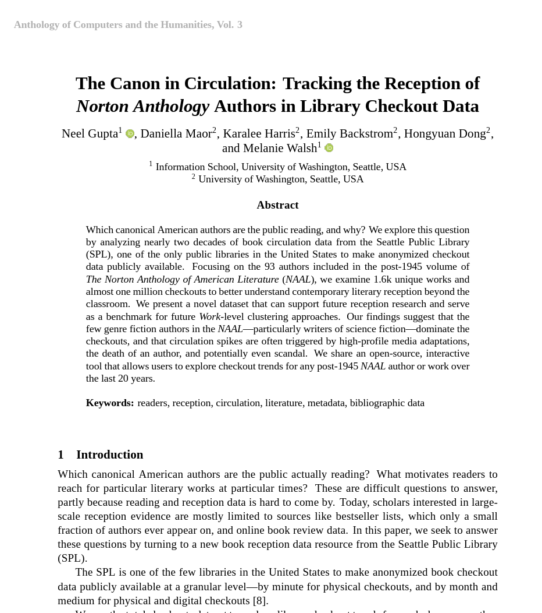
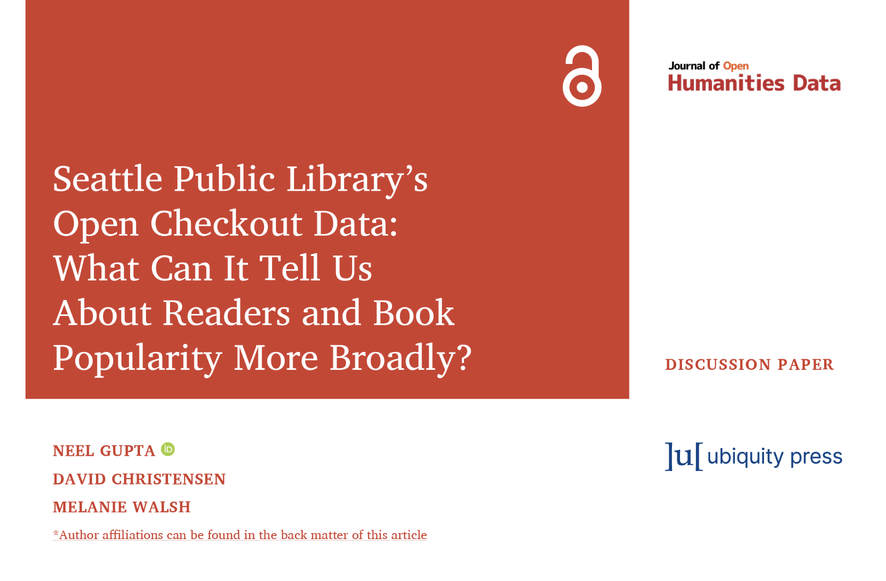

Check out our publications related to checkout data from the Seattle Public Library.
 
## 2025

### December

[**“The Canon in Circulation: Tracking the Reception of <em>Norton Anthology</Em> Authors in Library Checkout Data.”**](https://doi.org/10.63744/P6qPH135jhY2)   
Neel Gupta, Daniella Maor, Karalee Harris, Emily Backstrom, Hongyuan Dong, and Melanie Walsh. 
*Computational Humanities Research* (2025): 1510–22. 
[DOI](https://doi.org/10.63744/P6qPH135jhY2).  
[Data](https://seattle-library-checkout-data.s3.us-west-2.amazonaws.com/norton-anthology_spl-checkouts_2005-2025.csv)|[Code](https://github.com/melaniewalsh/Canon-in-Circulation)


<!-- [{width=60%}](https://doi.org/10.63744/P6qPH135jhY2) -->

Copy BibTeX:
```bibtex
@inproceedings{guptaCanonCirculationTracking2025,
  title = {The {{Canon}} in {{Circulation}}: {{Tracking}} the {{Reception}} of {{Norton Anthology Authors}} in {{Library Checkout Data}}},
  shorttitle = {The {{Canon}} in {{Circulation}}},
  booktitle = {Computational {{Humanities Research}}},
  author = {Gupta, Neel and Maor, Daniella and Harris, Karalee and Backstrom, Emily and Dong, Hongyuan and Walsh, Melanie},
  editor = {Arnold, Taylor and Fantoli, Margherita and Ros, {and} Ruben},
  year = 2025,
  volume = {3},
  pages = {1510--1522},
  doi = {10.63744/P6qPH135jhY2},
  urldate = {2025-12-10},
   url={https://anthology.ach.org/volumes/vol0003/the-canon-in-circulation-tracking-reception-of-in/}
}
```

### August

[**“Seattle Public Library’s Open Checkout Data: What Can It Tell Us About Readers and Book Popularity More Broadly?”**](https://doi.org/10.5334/johd.332)  
Neel Gupta, David Christensen, and Melanie Walsh.  
*Journal of Open Humanities Data* 11, no. 1 (2025). [DOI](https://doi.org/10.5334/johd.332).   
[Data](https://zenodo.org/records/15792698)|[Code](https://github.com/neelgupta2112/Seattle-Public-Library-Library-Checkout-Data) 

<!-- [{width=60%}](https://doi.org/10.5334/johd.332) -->


Copy BibTeX:
```bibtex
@article{guptaSeattlePublicLibrarys2025,
  title = {Seattle {{Public Library}}'s {{Open Checkout Data}}: {{What Can It Tell Us About Readers}} and {{Book Popularity More Broadly}}?},
  shorttitle = {Seattle {{Public Library}}'s {{Open Checkout Data}}},
  author = {Gupta, Neel and Christensen, David and Walsh, Melanie},
  year = 2025,
  month = aug,
  journal = {Journal of Open Humanities Data},
  volume = {11},
  number = {1},
  issn = {2059-481X},
  doi = {10.5334/johd.332},
  urldate = {2025-12-10},
  url = {https://openhumanitiesdata.metajnl.com/articles/10.5334/johd.332}
}
```

## 2022

[**"Where is all the book data?"**](https://www.publicbooks.org/where-is-all-the-book-data/)  
Melanie Walsh.  
*Public Books*.